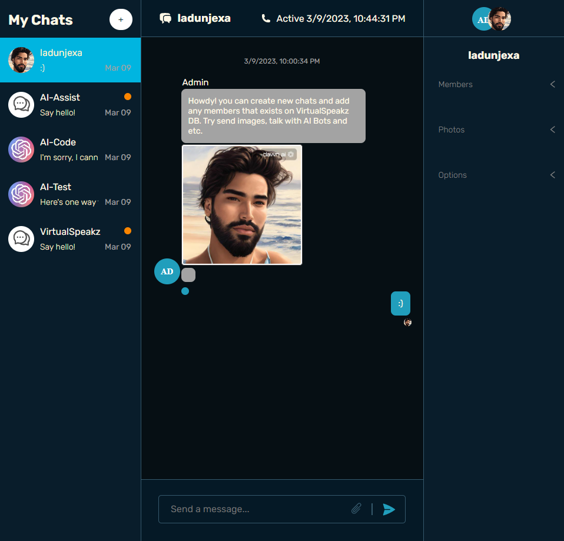

<a name="readme-top"></a>
<div align="center">

  
  

  <h1>VirtualSpeakz AI Messenger</h1>
  <p>
    <i>VirtualSpeakz-AI</i> Messenger is a phenomenal Chat Application integrating clever GPT bots for assistant, chat, and coding built with ChatEngine & OpenAI.
  </p>

<!-- Badges -->
<p>
  <a href="https://github.com/ladunjexa/VirtualSpeakz-AI-Messenger/graphs/contributors">
    
  </a>
  <a href="">
    
  </a>
  <a href="https://github.com/ladunjexa/VirtualSpeakz-AI-Messenger/network/members">
    
  </a>
  <a href="https://github.com/ladunjexa/VirtualSpeakz-AI-Messenger/stargazers">
    
  </a>
  <a href="https://github.com/ladunjexa/VirtualSpeakz-AI-Messenger/issues/">
    
  </a>
  <a href="https://github.com/ladunjexa/VirtualSpeakz-AI-Messenger/blob/master/LICENSE">
    
  </a>
</p>
   
 <h4>
    <a href="https://virtual-speakz-ai-messenger.vercel.app/">View Demo</a>
  <span> · </span>
    <a href="https://github.com/ladunjexa/VirtualSpeakz-AI-Messenger">Documentation</a>
  <span> · </span>
    <a href="https://github.com/ladunjexa/VirtualSpeakz-AI-Messenger/issues/">Report Bug</a>
  <span> · </span>
    <a href="https://github.com/ladunjexa/VirtualSpeakz-AI-Messenger/issues/">Request Feature</a>
  </h4>
</div>

<br />

<!-- Table of Contents -->
<details>

<summary>

# :notebook_with_decorative_cover: Table of Contents

</summary>

- [About the Project](#star2-about-the-project)
  * [Folder Structure](#bangbang-folder-structure)
  * [Environment Variables](#key-environment-variables)
  * [Tech Stack](#space_invader-tech-stack)
- [Getting Started](#toolbox-getting-started)
  * [Installation](#gear-installation)
  * [Run Locally](#running-run-locally)
- [Contributing](#wave-contributing)
- [License](#warning-license)
- [Contact](#handshake-contact)
- [Acknowledgements](#gem-acknowledgements)

</details>  

<!-- About the Project -->
## :star2: About the Project

<div align="center">
  
</div>

<br />

This repository houses a phenomenal AI Chat Application integrating clever OpenAI bots for assistant, chat and coding - built with @chatengine-io & @openai api. 🤖

<!-- Folder Structure -->
### :bangbang: Folder Structure

Here is the folder structure of _VirtualSpeakz-AI Messenger_.
```bash
VirtualSpeakz-AI-Messenger/
|- client/
  |- public/
  |- src/
    |- assets/
    |- components/
      |- chat/
        |- index.jsx
      |- header/
        |- index.jsx
      |- login/
        |- index.jsx
      |- messageForm/
        |- Ai.jsx
        |- AiAssist.jsx
        |- AiCode.jsx
        |- MessageFormUI.jsx
        |- StandardMessageForm.jsx
    |- state/
      |- api.js
    |- App.jsx
    |- index.scss
    |- main.jsx
    |- .env
    |- jsconfig.json
    |- .eslintrc.json
    |- vite.config.js
    |- package.json
|- server/
  |- routes/
    |- auth.js
    |- openai.js
  |- index.js
  |- .env
  |- package.json
```
<br />
<!-- ENV VARIABLES -->
### :key: Environment Variables

In order to use *VirtualSpeakz-AI* Messenger you have to add some environment variables to .env files,
*VirtualSpeakz-AI* uses OpenAI's API and Chat Engine API, so, you've to create openAI api key [here](https://openai.com/api) and a Chat Engine account [here](https://chatengine.io/), to run this webapp, meet with the conditions below.\

##### _client-side_ [client/.env] 
create `.env` file in `client/` directory & add the following environment variables:
```env
VITE_BASE_URL=<SERVER_URL>
VITE_PROJECT_ID=<CHAT_ENGINE_PROJECT_ID>
```

##### _server-side_ [server/.env]
create `.env` file in `server/` directory & add the following environment variables:
```env
PORT=<PORT>
OPENAI_API_KEY=<OPEN_AI_API_KEY>
CE_PROJECT_ID=<CHAT_ENGINE_PROJECT_ID>
CE_PRIVATE_KEY=<CHAT_ENGINE_PRIVATE_KEY>
CE_BOT_USER_NAME=<SYSTEM_AI_BOT_USER_NAME>
CE_BOT_USER_SECRET=<SYSTEM_AI_BOT_USER_SECRET>
```
<!-- User -->
### :scroll: Account Details

In order to use _VirtualSpeak-AI_ chat application you've to sign up and creating chats.
Use of AI chat will do so creating chat named `AI-{Chat/Code/Assist}`.
Details for account in which all chats exists:

```javascript
Username: Admin
Password: 123321
```

<!-- TechStack -->
### :space_invader: Tech Stack

[](https://skillicons.dev)

<p align="right">(<a href="#readme-top">back to top</a>)</p>

<!-- Getting Started -->
## :toolbox: Getting Started

<!-- Installation -->
### :gear: Installation

#### Step 1:
Download or clone this repo by using the link below:

```bash
 https://github.com/ladunjexa/VirtualSpeakz-AI-Messenger
```

#### Step 2:

_VirtualSpeakz-AI_ using NPM (Node Package Manager), therefore, make sure that Node.js is installed by execute the following command in console:

```bash
  node -v
```

#### Step 3:

At the main folder execute the following command in console to get the required dependencies:

```bash
  npm install
```

#### Step 4:

At the main folder execute the following command in console to creates a build directory with a production build of *VirtualSpeakz-AI*:

```bash
  npm run build
```

#### Step 5:

At the main folder execute the following command in console to run the server:

```bash
  npm run start
```

<!-- Run Locally -->
### :running: Run Locally

#### Step 1:

At the main folder execute the following command in console to get the required dependencies:

```bash
  npm install
```

#### Step 2:

At the main folder execute the following command in console to run the development server:

```bash
  npm run dev
```

<p align="right">(<a href="#readme-top">back to top</a>)</p>

<!-- Contributing -->
## :wave: Contributing

<a href="https://github.com/ladunjexa/VirtualSpeakz-AI-Messenger/graphs/contributors">
  
</a>


Contributions are always welcome!

See [`contributing.md`](https://contributing.md/) for ways to get started.

Contributions are what make the open source community such an amazing place to learn, inspire, and create. Any contributions you make are **greatly appreciated**.

If you have a suggestion that would make this better, please fork the repo and create a pull request. You can also simply open an issue with the tag "enhancement".
Don't forget to give the project a star! Thanks again!

1. Fork the Project
2. Create your Feature Branch (`git checkout -b feature/AmazingFeature`)
3. Commit your Changes (`git commit -m 'Add some AmazingFeature'`)
4. Push to the Branch (`git push origin feature/AmazingFeature`)
5. Open a Pull Request

<p align="right">(<a href="#readme-top">back to top</a>)</p>

<!-- License -->
## :warning: License

Distributed under the MIT License. See [LICENSE.txt](https://github.com/ladunjexa/VirtualSpeakz-AI-Messenger/blob/main/LICENSE) for more information.

<p align="right">(<a href="#readme-top">back to top</a>)</p>

<!-- Contact -->
## :handshake: Contact

Liron Abutbul - [@lironabutbul6](https://twitter.com/lironabutbul6) - [@ladunjexa](https://t.me/ladunjexa)

Project Link: [https://github.com/ladunjexa/VirtualSpeakz-AI-Messenger](https://github.com/ladunjexa/VirtualSpeakz-AI-Messenger)

<p align="right">(<a href="#readme-top">back to top</a>)</p>

<!-- Acknowledgments -->
## :gem: Acknowledgements

This section used to mention useful resources and libraries that used in _VirtualSpeakz-AI_.

#### CLIENT

 - [Vite Dev](https://vitejs.dev/)
 - [React](https://reactjs.org/)
 - [Chat Engine Advanced](https://github.com/chatengine-io/react-chat-engine-advanced)
 - [React Router v6](https://reactrouter.com/en/main)
 - [React Dropzone](https://www.npmjs.com/package/react-dropzone)
 - [React Redux](https://react-redux.js.org/)
 - [Sass](https://sass-lang.com/)
 - [dotenv](https://www.npmjs.com/package/dotenv)

#### SERVER

 - [Axios](https://www.npmjs.com/package/axios)
 - [Body Parser](https://www.npmjs.com/package/body-parser)
 - [CORS](https://developer.mozilla.org/en-US/docs/Web/HTTP/CORS)
 - [dotenv](https://www.npmjs.com/package/dotenv)
 - [Express](https://expressjs.com/)
 - [Helmet](https://www.npmjs.com/package/helmet)
 - [Morgan](https://www.npmjs.com/package/morgan)
 - [OpenAI](https://openai.com/)

<p align="right">(<a href="#readme-top">back to top</a>)</p>
